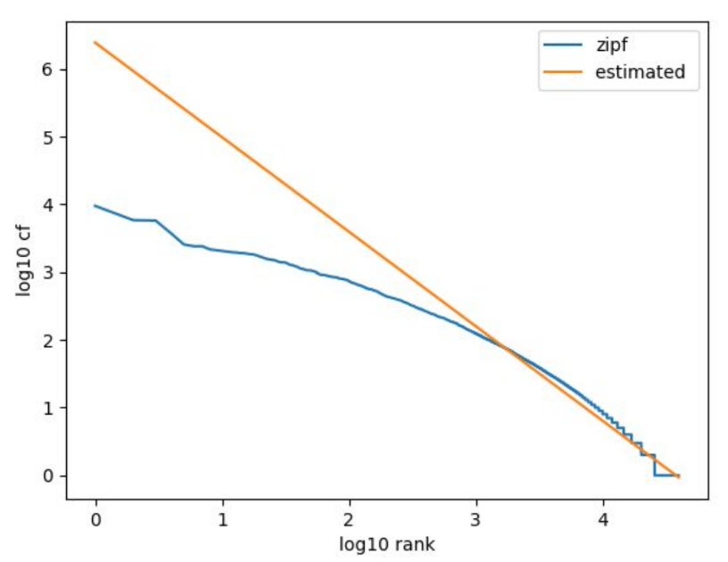
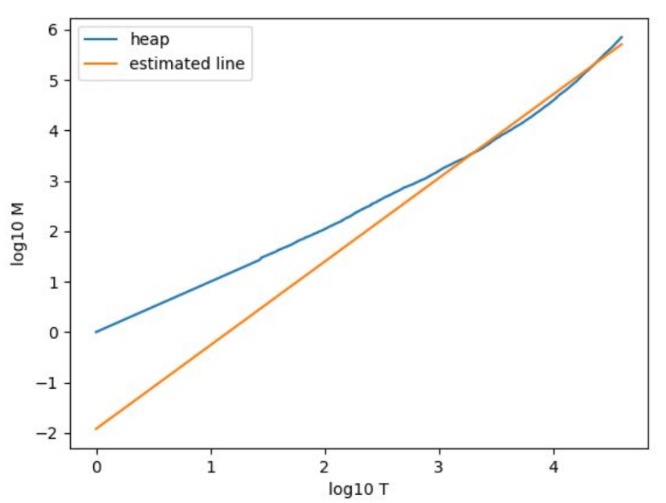

# Obama Mccain Debate Tweet Classification 

This repository contains the project of Advance Information Retrieval course at University of Tehran.

As you remember there was a lot tweets after Obama and Maccain debate for the 2008 election of US. The main task of this project was to find out tweet owners are in which side, Obama or Mccain.

First of all I draw two charts for Zipf and Heap estimates.

*Zipf Chart*



*Heap Chart*



As you can see, both charts show how normal the variety and quantity of words are. 

After that I tried to solve the main problem. As you can see, the [data](./StrictOMD.csv) is supervised and the target is a number between 0 and 4 which shows how much each of twitter users are attracted to each candidate. (0 is for one of them and 4 is another one).

After loading the data, I should preprocess the text to prevent unusual classification errors. This is the procedure of preprocessing each tweet.

```
def preprocess(tweet):
    tweet.lower()
    # lorwercasing letters so the same words wont count as different words

    tweet = re.sub(r"http\S+|www\S+|https\S+", '', tweet, flags=re.MULTILINE)
    # delete links becuase they don't add meaning

    tweet = re.sub(r'\@\w+|\#\w+', '', tweet)
    # delete hashtags and nametags(usually it's not a right thing to do but here only two hashtags were used)

    tweet = tweet.translate(str.maketrans('', '', string.punctuation))
    # delete punctuations

    tweet_tokens = word_tokenize(tweet)
    filtered_words = [w for w in tweet_tokens if not w in stop_words]
    # delete stopwords

    result = " ".join(filtered_words)
    return result
```

After that, I used TF-IDF to create feature vector of each tweet. (I tried Word Bags two, but it didn't have a better accuracy)

```
def get_feature_vector(train_fit):
    vector = TfidfVectorizer(sublinear_tf=True)
    vector.fit(train_fit)
    return vector
```

And at the end, I used Support Vector Machine to predict the results (which is fast and had enough accuracy among linear regression classifier and neural network).

```
cv = ShuffleSplit(n_splits=5, test_size=0.25, random_state=0)
SVC_model = SVC(kernel='linear', C=1, random_state=42)
scores = cross_val_score(SVC_model, X, y, cv=cv)
```

And the result for cross validation is `[0.78165939 0.81659389 0.82532751 0.78165939 0.83406114]`.

Also you can run my code such as below (first line is for installing dependencies).
```
> pip3 install -r requirements.txt 
> python3 classification.py
```

